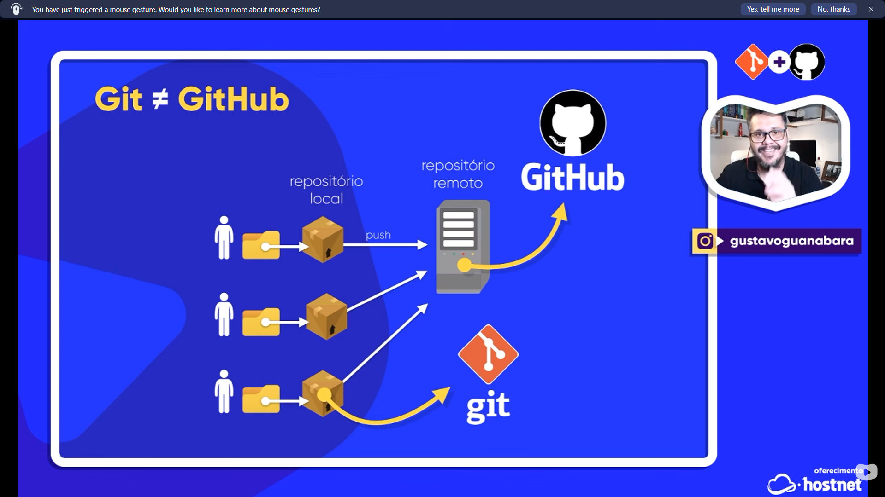

# 📚 Diário de Estudos

## 📅 11-03-2026 | 🎯 git_github_markdown_fase1

---

## 📝 Resumo
- **Duração:**
- **Conteúdo:** Comandos Git essenciais e formatação Markdown básica
- **Fontes:** Documentação oficial, GitHub Guides

---

## 🎯 Aprendizados Principais

### **📋 Comandos Git Essenciais**

#### **🔧 Configuração**
```bash
# Configurar usuário
git config --global user.name "Seu Nome"
git config --global user.email "seu@email.com"
```

#### **📁 Repositório**
```bash
# Iniciar novo repositório
git init

# Clonar repositório existente
git clone https://github.com/user/repo.git

# Verificar status
git status
```

#### **📝 Arquivos**
```bash
# Adicionar arquivo específico
git add arquivo.txt

# Adicionar todos os arquivos
git add .

# Ver mudanças antes de commit
git diff
```

#### **💾 Commits**
```bash
# Fazer commit
git commit -m "Mensagem clara"

# Adicionar e commitar tudo de uma vez
git commit -am "Mensagem rápida"
```

#### **🌐 GitHub (Remote)**
```bash
# Adicionar repositório remoto
git remote add origin https://github.com/user/repo.git

# Ver repositórios remotos
git remote -v

# Remover repositório remoto
git remote remove origin

# Enviar para GitHub
git push -u origin main  # primeira vez
git push               # demais vezes

# Puxar mudanças do GitHub
git pull

# Baixar sem mesclar
git fetch

# Forçar push (cuidado)
git push --force origin main
```

#### **⏮️ Desfazer**
```bash
# Desfazer mudanças não salvas
git restore arquivo.txt

# Desfazer último commit (mantém arquivos)
git reset --soft HEAD~1

# Reverter commit específico
git revert hash-do-commit

# Remover Git completamente da pasta
# Linux/Mac:
rm -rf .git
git clean -fd  # remove arquivos não rastreados

# Windows (PowerShell):
Remove-Item -Recurse -Force .git

# Windows (CMD):
rmdir /s /q .git
```

#### **🌿 Branches**
```bash
# Ver branches
git branch        # locais
git branch -a    # locais e remotas

# Criar e mudar para nova branch
git checkout -b nova-branch
git switch -c nova-branch

# Mudar para branch existente
git checkout nome-branch
git switch nome-branch

# Renomear branch atual
git branch -m novo-nome

# Deletar branch
git branch -d nome-branch    # local
git push origin --delete nome-branch  # remota

# Juntar branches
git merge nova-branch
```

#### **📊 Histórico**
```bash
# Ver commits
git log --oneline  # recentes
git log           # completo

# Ver mudanças específicas
git show

# Ver gráfico de branches
git log --graph --oneline --all
```

#### **🔄 GitHub CLI**
```bash
# Criar repositório
gh repo create nome-do-repo --public

# Ver informações
gh repo view

# Criar issue/PR
gh issue create --title "Título"
gh pr create --title "PR"

# Autenticar
gh auth login
gh auth status
```

#### **🌐 Criar Repositório Manual**
```bash
# 1. Criar no site: https://github.com/new

# 2. Configurar local
git init
git add .
git commit -m "Primeiro commit"

# 3. Conectar
git remote add origin https://github.com/user/repo.git
git branch -M main

# 4. Enviar
git push -u origin main
```

#### **🔐 Autenticação GitHub CLI**
```bash
# Login/Logout
gh auth login
gh auth logout

# Status e token
gh auth status
gh auth token
```

#### **📦 GitHub LFS - Arquivos Grandes (>100MB)**
```bash
# Instalar Git LFS
git lfs install

# Adicionar tipos de arquivos grandes
git lfs track "*.csv"
git lfs track "*.xlsx"
git lfs track "*.parquet"

# Commit do .gitattributes
git add .gitattributes
git commit -m "Configure Git LFS"

# Adicionar arquivo grande
git add arquivo_grande.csv
git commit -m "Add large dataset"
git push

# Baixar arquivos LFS
git lfs pull

# Verificar arquivos baixados
ls -la data/
```

#### **🚀 GitHub Releases - Download Direto**
```bash
# Via curl/wget
wget https://github.com/user/repo/releases/download/v1.0/arquivo.csv
curl -O https://github.com/user/repo/releases/download/v1.0/arquivo.csv

# Via Python
import pandas as pd
url = "https://github.com/user/repo/releases/download/v1.0/arquivo.csv"
df = pd.read_csv(url)

# Download múltiplos arquivos
import requests
files = [
    "survey_results_public.csv",
    "survey_results_schema.csv"
]

for file in files:
    url = f"https://github.com/user/repo/releases/download/v1.0/{file}"
    df = pd.read_csv(url)
    print(f"Arquivo {file} carregado: {len(df)} linhas")
```

#### **📋 Criar GitHub Release (Passo a Passo)**
1. **Acessar**: https://github.com/user/repo/releases
2. **Criar Release**: Clique em "Create a new release"
3. **Configurar**:
   - Tag: `v1.0` (exemplo)
   - Title: "Dataset Release v1.0"
   - Description: "Contém arquivos CSV para análise"
4. **Upload**: Arraste arquivos para "Release assets"
5. **Publicar**: Clique em "Publish release"

#### **🔄 Exemplo Completo - Workflow com Dados Grandes**
```bash
# 1. Setup inicial
git clone https://github.com/user/repo.git
cd repo
git lfs install

# 2. Configurar LFS para CSV
git lfs track "*.csv"
git add .gitattributes
git commit -m "Add CSV to LFS tracking"

# 3. Adicionar dataset grande
wget https://exemplo.com/dataset_grande.csv
git add dataset_grande.csv
git commit -m "Add large dataset"
git push

# 4. Criar release para acesso direto
# (via interface web ou GitHub CLI)
gh release create v1.0 dataset_grande.csv \
  --title "Dataset v1.0" \
  --notes "Dataset para análise de dados"

# 5. Download por outros usuários
# Via LFS:
git lfs pull

# Via Release:
wget https://github.com/user/repo/releases/download/v1.0/dataset_grande.csv
```

#### **🗑️ Remover Arquivos**
```bash
# Remover arquivo do diretório e do Git
git rm arquivo.txt

# Remover arquivo apenas do Git
git rm --cached arquivo.txt

# Remover pasta
git rm -r pasta/

# Remover arquivos já deletados
git add -A
git commit -m "Limpar arquivos deletados"
```

#### **�� Fluxo Diário**
```bash
# 1. Atualizar com GitHub
git pull

# 2. Trabalhar nos arquivos
# ... editar ...

# 3. Ver o que mudou
git status

# 4. Salvar mudanças
git add .
git commit -m "O que foi feito"

# 5. Enviar para GitHub
git push
```

> **💡Comandos Markdown Essenciais** 🚀

---

### **📝 Markdown Básico**

#### **🔤 Formatação de Texto**
```markdown
# Título 1
## Título 2
### Título 3

**Texto em negrito**
*Texto em itálico*
~~Texto riscado~~
`Código inline`
```

#### **📋 Listas**
```markdown
# Lista não ordenada
- Item 1
- Item 2
  - Subitem 2.1
  - Subitem 2.2

# Lista ordenada
1. Primeiro item
2. Segundo item
3. Terceiro item

# Lista de tarefas
- [ ] Tarefa pendente
- [x] Tarefa concluída
```

#### **🔗 Links e Imagens**
```markdown
# Link
[Texto do link](https://exemplo.com)

# Imagem


# Link em imagem
[](https://exemplo.com)
```

#### **📊 Tabelas**
```markdown
| Coluna 1 | Coluna 2 | Coluna 3 |
|----------|----------|----------|
| Dado 1   | Dado 2   | Dado 3   |
| Dado 4   | Dado 5   | Dado 6   |

# Alinhamento
| Esquerda | Centro | Direita |
|:---------|:------:|--------:|
| Texto    | Texto  | Texto   |
| Dados    | Dados  | Dados   |
```

#### **💻 Código**
```markdown
# Código inline
Use o comando `git status` para verificar.

# Bloco de código
```bash
git add .
git commit -m "Mensagem"
```

# Código com sintaxe destacada
```python
def hello_world():
    print("Hello, World!")
```
```

#### **📌 Citações e Destaques**
```markdown
# Citação
> Isso é uma citação importante.
> Pode ter múltiplas linhas.

# Citação aninhada
> Citação principal
>> Citação aninhada

# Linha horizontal
---
***
___
```

#### **🔧 Outros Elementos**
```markdown
# Texto com HTML
<u>Sublinhado</u>
<mark>Destacado</mark>

# Emojis
:rocket: 🚀
:book: 📚
:computer: 💻

# Referências
Veja a [seção de comandos][git] para mais detalhes.

[git]: #-comandos-git-essenciais


*Criado em: 11/03/2026 13:10*
